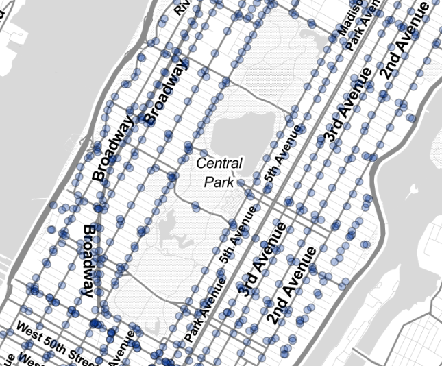

# Interactive Mapping NYC Bus Stops

The link to my map can be found <a href="https://j21ongcol.github.io/Lab2-InteractiveMapping/Lab2-InteractiveMapping/FinalMap.html" title="Lab 2: Interactive Mapping" target="_blank">here</a>.
 

Collaborations and Resources:

From the peer critique, I received mix feelings about the original colours of the point data and the tileset used for the basemap. I retreived the tileset design from the leaflet link provided from our previous assignments, and chose the design because of the minial colours and bold labels. I did not end up changing the tileset because of personal choice. I drew upon all the coding resources provided in class lectures, with some assistance and clarifications from classmates, but no significant collaborations. 

Reflective Analysis:

After our lesson on filtering data on maps, I knew I wanted that same type of interactivity in my map for lab 2. For this lab, I decided to map New York City bus stops. I retrieved the bus stop data from a public repository on github that contained various point data, along with the one I chose for this lab. For the interactivity, I added a filter button, a button that would display all point data, and a mouse hovering element. The text box allows a user to search a NYC borough (Staten island, Queens, Brooklyn, the Bronx and Manhattan) which would display all the bus stops recorded in that specific borough. The ‘show all bus stops’ button allows users to display all the bus stops of every borough in the city, and the last element of interactivity was the hover element. When the user directs the mouse over a bus stop, the bus stop address would automatically be displayed. 

For myself, I knew of the different boroughs of NYC but never knew their actual location in relation to each other. When I created the filter element, it gave me a better understanding of their locations based on where bus stops are registered. I would say my map would be designed for new migrants unfamiliar with the different boroughs and the location of bus stops to provide knowledge on public transit in the city. I believe my map can be improved by not having the point data cover the labels/titles of the city, or have some type of halo-effect to reduce the coverage. I also think it can be improved by using a different type of data less numerous than the bus stops of NYC, because I believe the shear amount of points create a slightly intimidating map. Due to this, I changed the opacity of the points to ease overlap created by the shear amount of data points. 

Choosing a colour for the point data took the longest to finalize.  Because my basemap depicted land areas as white, I wanted a colour to standout from the white background. With some quick research on the transit buses of New York, I discovered that the exterior of MTA buses in the city follow a royal blue and white colour scheme. For an artistic and thoughtful touch, I finalized the points to be the same shade of blue as the New York city buses. 

